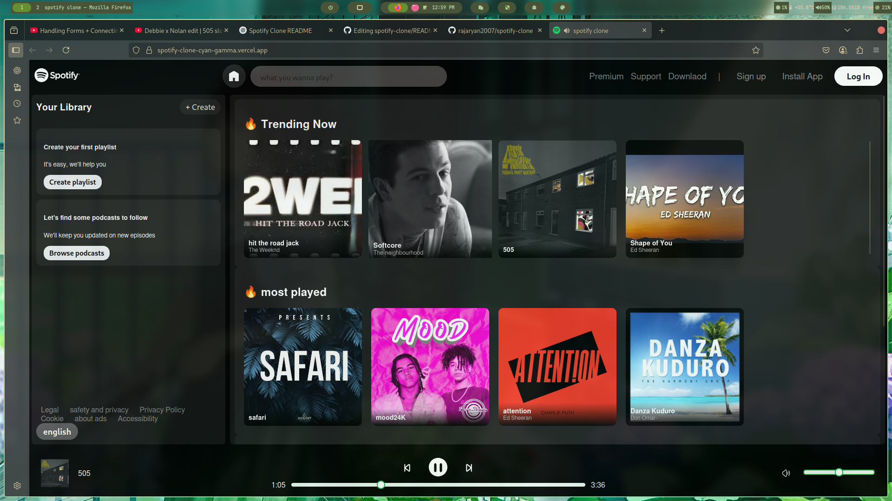

# 🎵 Spotify Clone

A responsive and interactive Spotify Clone built using HTML, CSS, and JavaScript. This project replicates key features of the Spotify web player, including a music list, playback controls, seek bar, and volume control.

## 🔗 Live Demo

👉 [Visit the Live App](https://spotify-clone-cyan-gamma.vercel.app/)

---

## 🚀 Features

- 🎧 Display of songs with cover art and titles
- ⏯️ Play, Pause, and Skip controls
- 📈 Seek bar for tracking progress
- 🔊 Volume control
- ⚡ Fully responsive layout for mobile and desktop

---

## 📸 Screenshots

---

## 🛠️ Built With

- **HTML5**
- **CSS3**
- **JavaScript (ES6)**

---

## 📁 Folder Structure

